# 🏥 Medical AI Assistant System  
_A full-stack, multi-agent healthcare assistant powered by **IBM watsonx.ai** and **watsonx Orchestrate**_

[]()
[]()

> This repository delivers an **MCP-compliant server**, a **12-agent medical workforce**, and full DevOps tooling so you can stand up an enterprise-grade medical-AI platform in minutes.

---

## 🚀 Key Features

| Category              | Highlights                                                                                                                   |
|-----------------------|------------------------------------------------------------------------------------------------------------------------------|
| **Core MCP Server**   | FastMCP over STDIO (or HTTP) · watsonx.ai chat + symptom-analysis tools · Conversation history / summaries                   |
| **Multi-Agent Suite** | 10 specialty agents (Pediatrics → Oncology) · **Medical Coordinator** for smart routing · **Emergency Triage** for escalation |
| **Dev & Ops**         | Makefile workflow · Docker image · Health-check + monitoring scripts · Pytest suite                                           |
| **Production Grade**  | `.env`-driven configs · Error handling & logging · Auto-deployment scripts (`deploy.sh`, `deploy_specialists.sh`)            |
| **Scalability**       | Add new YAML agents in `medical_agents/` and re-run deploy – zero code changes                                               |

---

## 🗂️ Repository Layout

```text
medical-ai-assistant-system/
├── watsonx-medical-mcp-server/   # cloned MCP server (FastMCP, watsonx.ai tools)
│   ├── server.py                 # MCP entry-point (STDIO)
│   └── …                         # its own Makefile, tests, docs
├── medical_agents/               # YAML definitions for all agents
├── scripts/
│   ├── deploy.sh                 # One-command full deployment
│   ├── deploy_specialists.sh     # Import / update specialist agents only
│   ├── system_health_check.sh    # Comprehensive health check
│   ├── test_collaboration.py     # Multi-agent scenario tests
│   └── monitor_agents.py         # Runtime metrics & reports
├── Dockerfile
├── Makefile                      # top-level dev workflow
├── requirements.txt              # minimal extras (tests, tooling)
├── .env.example
└── README.md                     # ← you are here
````

> **Note**
> The first time you run `make setup`, the **Makefile automatically clones**
> `https://github.com/ruslanmv/watsonx-medical-mcp-server` into the sub-folder
> `watsonx-medical-mcp-server/`. That repo contains the actual MCP server code.

---

## ⚙️ Prerequisites

| Requirement                 | Notes                                 |
| --------------------------- | ------------------------------------- |
| **Python 3.11+**            | Local dev & tests                     |
| **watsonx.ai** credentials  | API Key · Service URL · Project ID    |
| **watsonx Orchestrate ADK** | `pip install ibm-watsonx-orchestrate` |
| **Docker (+ Compose)**      | *Optional* – container workflows      |
| **Git**                     | Clone & version control               |

---

## 🛠️ Quick Start

1. **Clone & enter repo**

   ```bash
   git clone https://github.com/ruslanmv/Medical-AI-Assistant-System.git
   cd Medical-AI-Assistant-System
   ```

2. **Bootstrap the environment**

   ```bash
   make setup          # clones MCP repo, creates .venv, installs deps
   ```

3. **Add credentials**

   ```bash
   cp .env.example .env
   # edit .env and add WATSONX_APIKEY, PROJECT_ID, ...
   ```

4. **Run everything**

   ```bash
   chmod +x scripts/deploy.sh
   ./scripts/deploy.sh
   ```

   The script will:

   * Test the MCP server locally
   * Import the MCP toolkit into watsonx Orchestrate
   * Deploy all 12 agents (or create editable templates)
   * Print a verification summary

5. **Chat with your agents**

   ```bash
   orchestrate chat start
   ```

   Try prompts like:

   * “I’m 28 weeks pregnant and my blood sugar is high.”
   * “My 4-year-old is wheezing.”
   * “I have chest pain and shortness of breath.”

---

## 🏗️ Architecture Overview

```mermaid
flowchart TD
  %% ─────────────────────────────
  %%  Style helpers
  %% ─────────────────────────────
  classDef comp fill:#f0f6ff,stroke:#0077c8,stroke-width:1px,rx:6,ry:6
  classDef agent fill:#fff7e8,stroke:#e96d00,stroke-width:1px,rx:6,ry:6
  classDef infra fill:#f8f9fa,stroke:#666,stroke-width:1px,rx:4,ry:4,font-style:italic

  %% ─────────────────────────────
  %%  Nodes
  %% ─────────────────────────────
  User([User / Chat UI])

  subgraph Orchestrate["IBM watsonx Orchestrate"]
    direction TB
    Toolkit["Medical MCP Toolkit"]:::comp
    Coordinator["Medical&nbsp;Coordinator<br>(routing)"]:::agent
    Triage["Emergency&nbsp;Triage<br>(critical escalation)"]:::agent
    class Orchestrate comp
  end

  subgraph Specialists["Specialist Agents"]
    direction TB
    Pediatrics["Pediatrics"]:::agent
    Endocrinology["Endocrinology"]:::agent
    Hypertension["Hypertension"]:::agent
    Asthma["Asthma"]:::agent
    Hepatology["Hepatology"]:::agent
    Obstetrics["Obstetrics"]:::agent
    Parkinsons["Parkinson's"]:::agent
    Oncology["Oncology"]:::agent
    GenMed["General&nbsp;Medicine"]:::agent
    Cardiology["Cardiology"]:::agent
  end

  subgraph MCP["watsonx-medical-mcp-server (repo)"]
    direction TB
    MCPServer["FastMCP Server<br>(Python 3.11)"]:::comp
    tools["Tools:<br/>• chat_with_watsonx<br/>• analyze_medical_symptoms<br/>• summaries / history"]:::infra
  end

  Watsonx(["IBM watsonx.ai<br/>Foundation Model"]):::infra
  Scripts["Health-Check / Monitoring / Deploy Scripts"]:::infra

  %% ─────────────────────────────
  %%  Edges
  %% ─────────────────────────────
  User --> |"chat"| Orchestrate
  Orchestrate --> |"tool invoke"| Toolkit
  Toolkit --> MCPServer
  Orchestrate --> Coordinator
  Orchestrate --> Triage
  Coordinator --> Specialists
  Triage --> Coordinator
  Specialists --> MCPServer

  MCPServer --> |"LLM calls"| Watsonx
  Scripts -. monitor .-> Orchestrate
  Scripts -. monitor .-> MCPServer


```



1. **MCP Server** (Python, FastMCP) handles all LLM calls to watsonx.ai.
2. **watsonx Orchestrate** imports the server as a **toolkit** and each YAML file as an **agent**.
3. **Coordinator / Triage Agents** route or escalate queries.
4. **Specialist Agents** provide domain-specific answers, calling the MCP tools under the hood.
5. **Scripts & Monitoring** keep the system healthy and production-ready.

---

## 📈 Monitoring & Testing

| Script                   | Purpose                                                                     |
| ------------------------ | --------------------------------------------------------------------------- |
| `system_health_check.sh` | One-click verification of toolkits, agents, creds, and watsonx connectivity |
| `test_collaboration.py`  | Simulated user scenarios to confirm multi-agent routing                     |
| `monitor_agents.py`      | Runtime metrics: request counts, response times, success rates              |

Run them anytime:

```bash
./scripts/system_health_check.sh
python scripts/test_collaboration.py
python scripts/monitor_agents.py
```

---

## 🐳 Docker Quick Start

Build and run the entire stack inside a container (ideal for MCP Gateway):

```bash
make docker-build     # builds python:3.11-slim image
make docker-run       # runs with .env credentials
```

Expose HTTP? Adjust `server.py` to `mcp.run(transport="http", host="0.0.0.0", port=8000)`
and publish with `-p 8000:8000`.

---

### 🧰 Makefile Cheat-Sheet


```text
# ── Bootstrap ───────────────────────────────────────────────────────────────
make setup              # Install/verify BOTH envs → ./venv (Orch) + MCP/.venv
make orch-setup         # Create ./venv and install Watsonx Orchestrate only
make mcp-setup          # Create watsonx-medical-mcp-server/.venv only
make init-mcp           # Ensure MCP repo present (clone / submodule)
make update-mcp         # Pull latest commit inside MCP repo
make reinstall          # Wipe both envs and rebuild from scratch

# ── Servers & Application ───────────────────────────────────────────────────
make start              # 🚀 Start the watsonx Orchestrate server (Docker-compose)
make run                # 🏃 Import agents/tools & launch Orchestrate app
make stop               # 🛑 Stop Orchestrate server & containers
make purge              # 🔥 Remove ALL Orchestrate containers & images
make run-mcp            # 🚀 Start the MCP server locally (STDIO)

# ── Development Workflow ────────────────────────────────────────────────────
make lint               # flake8 + black --check  (uses ./venv)
make format             # Auto-format with black
make test               # Run pytest suite
make check              # Lint + tests (CI green-light)

# ── Deploy & Ops Helpers ────────────────────────────────────────────────────
make deploy             # One-command full deploy (toolkit + 12 agents)
make deploy-specialists # Import / update specialist agents only
make health-check       # Comprehensive system health verification
make monitor            # Runtime metrics / performance report
make collab-test        # Multi-agent collaboration tests

# ── Docker Convenience ──────────────────────────────────────────────────────
make docker-build       # Build application image (python:3.11-slim base)
make docker-run         # Run container (requires .env with creds)
make docker-shell       # Drop into /bin/bash inside the image

# ── House-keeping ───────────────────────────────────────────────────────────
make clean              # Remove BOTH virtual-envs & Python caches
```


---

## 🤖 Extending the Platform

1. Drop a new YAML into `medical_agents/`, e.g. `dermatology_specialist_agent.yaml`.
2. Add its name to the array in `scripts/deploy_specialists.sh`.
3. Run `make deploy-specialists` — done!

---

## 📜 License

Apache 2.0 — see [LICENSE](LICENSE).
Built with ❤️ to make trustworthy health information more accessible.
*Always consult a qualified medical professional for personal health decisions.*

---

**Ready to transform healthcare?**
Run `./scripts/deploy.sh` and launch your multi-agent medical AI assistant today.
Stay healthy, and happy coding! ✨
